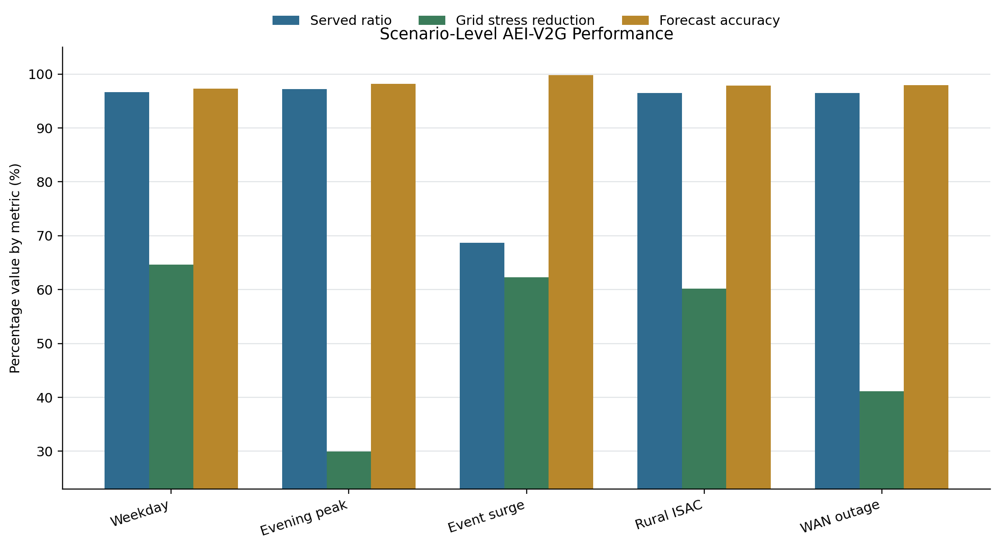
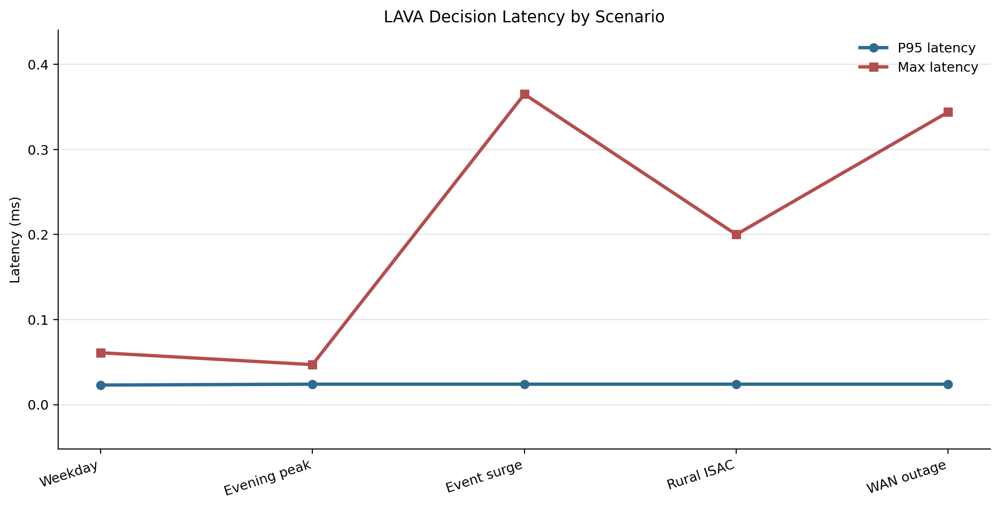
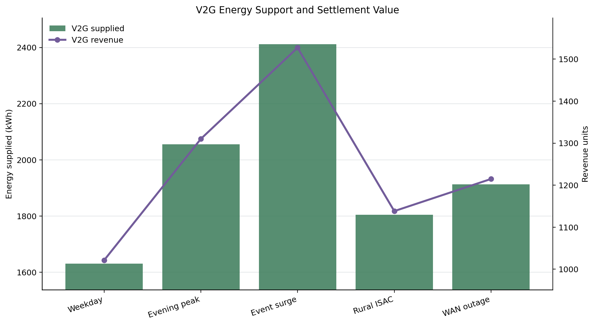
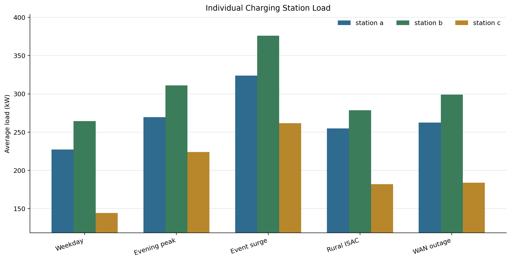
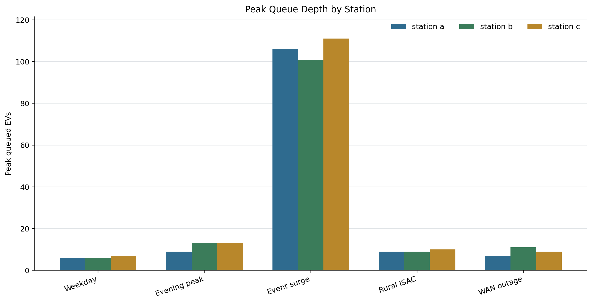
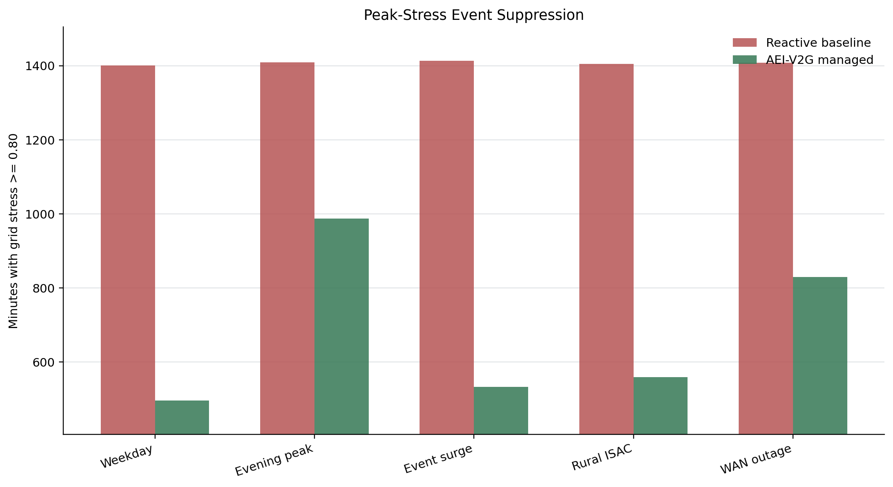
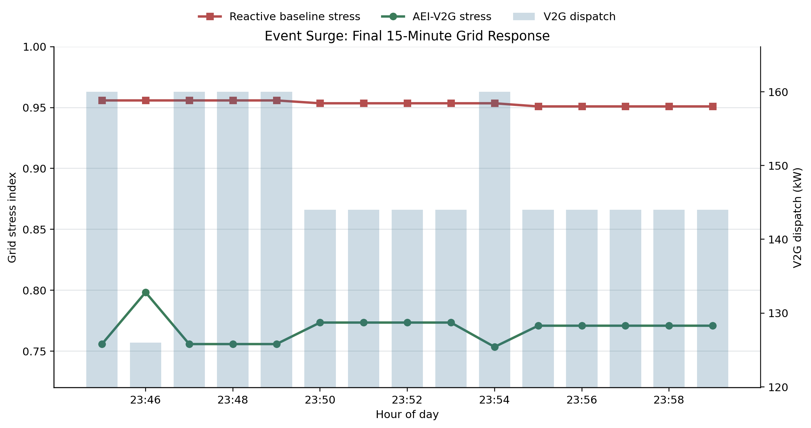
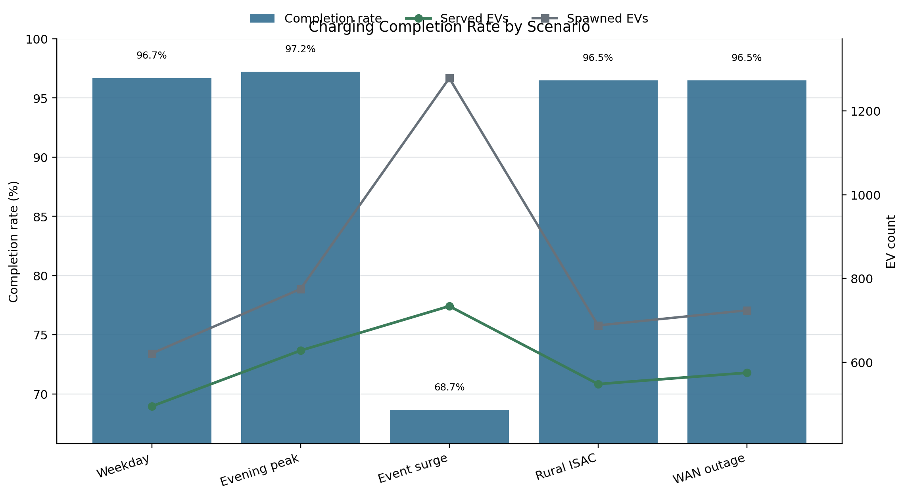
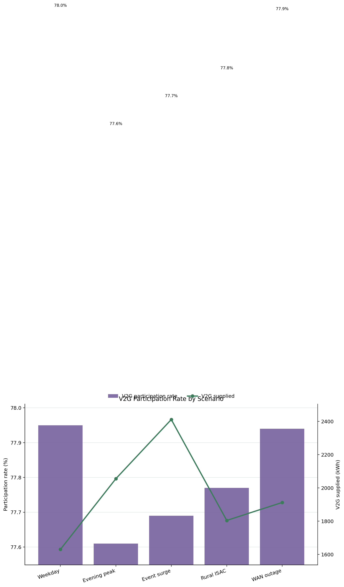
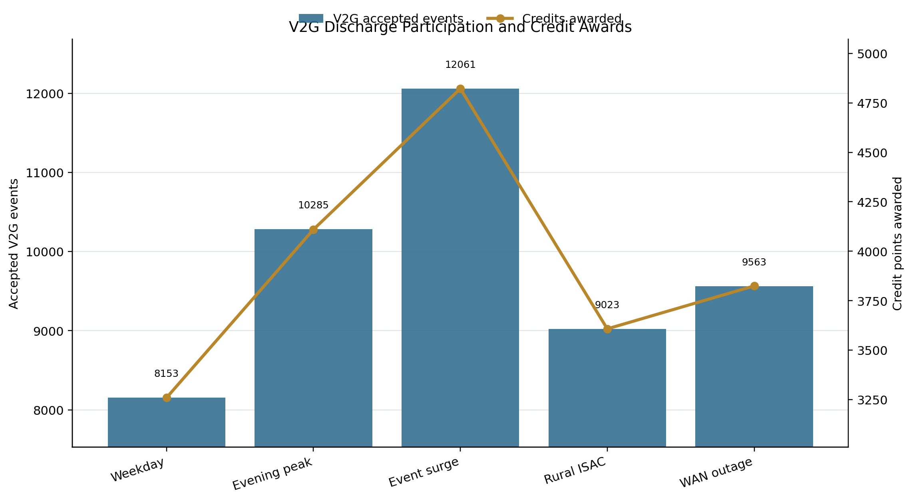

# AEI-V2G Journal Figures

Generated from `reports/journal_study` CSV and JSON artifacts.

## Figure 1

Scenario-level served ratio, grid-stress reduction, and forecast accuracy.

## Figure 2

LAVA P95 and maximum decision latency against the 200 ms target.

## Figure 3

V2G supplied energy and settlement value by scenario.

## Figure 4

Average load for each individual charging station.

## Figure 5

Peak queue depth for each individual charging station.

## Figure 6

Reactive baseline versus AEI-V2G peak-stress minutes.

## Figure 7

Event-surge final 15-minute grid response and V2G dispatch.

## Figure 8

Charging completion rate with served and spawned EV counts.

## Figure 9

V2G participation rate with supplied V2G energy.

## Figure 10

Accepted V2G discharge events compared with credit points awarded.
